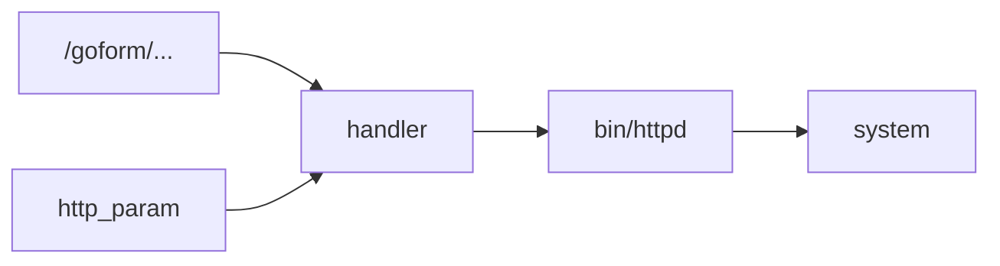

# FirmHound 差异化优势与创新路线

> 目的：解决“大家都是 Agent + Harness，我们凭什么不千篇一律”的核心叙事问题。本文档建议作为方案设计、技术报告、PPT 和答辩稿的统一创新口径。

## 1. 先给结论：最大优势不是“大模型”，而是“证据驱动的固件漏洞挖掘操作系统”

FirmHound 最适合被定义为：

> 面向 IoT 固件漏洞挖掘的证据驱动型 CLI 智能体。它不是让大模型自由发挥，而是把固件解包、攻击面恢复、二进制审计、风险评分、反证验证、动态验证和报告生成变成一条可恢复、可审计、可降级的证据生产流水线。

换句话说，别人如果讲“我让 Agent 调工具、写 Harness”，我们要讲：

> 我们把固件漏洞挖掘这件高误报、高不可复现、高安全风险的工作，设计成了一套有状态、有证据、有反证、有安全边界的漏洞研判系统。

这才像作品，不像提示词工程。

## 2. 不建议作为最大优势的表达

这些不要放在最大优势里：

- “我们用了大模型。”
- “我们有智能体。”
- “我们会自动调用工具。”
- “我们会生成 Harness。”
- “我们能让 Agent 自主挖洞。”

原因：

1. 比赛里大家都会这么写。
2. 评委会天然警惕大模型幻觉。
3. 网络安全作品不能把“模型会说”当成“系统可信”。
4. Harness 只是验证手段，不是系统壁垒。

## 3. 从现有系统中挖出来的真实优势

### 优势一：证据链优先，而不是结论优先

当前系统已经有：

- `EvidenceStore`
- `DecisionStore`
- `runs/<run_id>/evidence/`
- `runs/<run_id>/decisions/`
- `report.md`
- `final_verdict.json`
- candidate/verdict/evidence/decision 等 Schema

这说明 FirmHound 的结果不是一句“发现漏洞”，而是：

```text
输入样本 -> 阶段执行 -> 中间产物 -> 候选生成 -> 评分依据 -> 反证审查 -> 最终结论
```

材料表达建议：

> FirmHound 将漏洞挖掘过程从“结论生成”转化为“证据生产”。系统要求每个候选都绑定 source、sink、call_chain、validation、authorization、evidence 和 counterevidence，避免大模型直接给出不可复核的漏洞判断。

适合放在：

- 方案设计文档：总体设计、数据契约。
- 技术报告：证据模型。
- PPT：核心创新页。

配图建议：

- “漏洞结论不是终点，而是证据链最后一环”的链路图。
- `candidate -> evidence -> decision -> verdict -> report` 的 Schema 关系图。

### 优势二：反证优先，主动降低误报

当前系统已经有：

- 10 问人工审计清单。
- 12 条硬规则口径。
- `counterevidence` 字段。
- `ACCEPT / DOWNGRADE / REJECT / NEED_DYNAMIC` 裁决动作。
- `confirmed-issue / high-confidence-candidate / false-positive / unknown / observation` 五类结论。

这是一个很好的反同质化点。

很多队伍会讲“我发现了多少漏洞”，但 FirmHound 可以讲：

> 我们不追求报警数量，而追求可被复核的漏洞结论；系统先问“有没有证据证明它不是漏洞”，再决定是否升级为高置信候选。

材料表达建议：

> FirmHound 采用反证优先的漏洞研判机制：静态 source/sink 共现不会被直接判定为漏洞，必须经过可达性、认证、输入可控性、过滤逻辑、启动证据和矛盾证据检查。证据不足时系统输出 NEED_DYNAMIC 或 unknown，而不是制造高危告警。

配图建议：

- 反证验证决策树。
- “传统扫描器：候选 -> 告警” vs “FirmHound：候选 -> 反证 -> 分级结论”对比图。

### 优势三：诚实降级能力，而不是假装全能

当前系统已经真实体现：

- 外部工具缺失时 `degraded/skipped`。
- `doctor` 能显示 analyzeHeadless/KLEE 不可用。
- BE3LPro 加密固件识别为 OpenSSL Salted，需要解密材料。
- KLEE timeout/path explosion 不改分，只记 limitation。
- BOND 没有 sanitized trigger 不确认漏洞。
- FirmRec 在 Blind Run 中隔离，不能混入零先验发现。

这是非常值得突出的一点。

比赛评委会很清楚：固件解包、动态验证、符号执行不可能永远成功。真正成熟的系统不是“永远成功”，而是“失败也可信”。

材料表达建议：

> FirmHound 的可靠性优势不在于承诺所有固件都能解开，而在于每一次失败都有可解释状态、可恢复路径和明确边界。对于加密固件、缺失外部工具、动态验证不安全等情况，系统保留证据并降级输出，避免把工具失败伪装成漏洞结论。

配图建议：

- `ok / degraded / failed` 三色状态图。
- BE3LPro 加密固件案例卡片。
- “失败可解释”流程图。

### 优势四：安全内生，而不是后置免责声明

当前系统已经有：

- `config/safety.yaml`
- 路径白名单。
- 命令黑名单。
- 私有 IP 限制。
- 动态验证四道安全门。
- PoC sanitizer。
- 报告合规检查。

这点对网络安全比赛很重要。很多队伍会把安全边界写在最后一页免责声明，但你们是写进代码里的。

材料表达建议：

> FirmHound 将安全约束内嵌到执行链路中：授权主体、路径白名单、私有网络、安全 payload、报告脱敏都由策略引擎强制检查。系统不是“能不能攻击”的工具，而是“能不能在合规边界内形成安全证据”的防御分析工具。

配图建议：

- 四道安全门图：AUTHORIZED、LOCAL_LAB、PRIVATE_NETWORK、BASELINE_READY。
- 安全策略分层图：路径、命令、网络、payload、报告。

### 优势五：固件逆向的“前处理能力”强于普通 Agent

当前系统在真实固件测试中修过一批非常“固件味”的问题：

- binwalk 经典表格解析兼容。
- WSL wrapper 非交互防悬挂。
- SquashFS 魔数切片后继续解包。
- sasquatch 支持非标准 SquashFS。
- gzip 噪声抑制。
- 空目录成功误判修复。
- Windows symlink 容错。
- 加密载荷识别。

这些才是固件赛道的硬东西。普通 Agent + Harness 如果连 rootfs 都拿不到，后面全是空中楼阁。

材料表达建议：

> FirmHound 的底层优势是固件逆向前处理能力。系统不是在已知源码或理想输入上运行，而是面向真实厂商固件处理非标准文件系统、嵌套压缩、Linux 符号链接、厂商只读目录和加密载荷等问题，先把“能不能得到可信 rootfs”作为漏洞挖掘的第一道证据门。

配图建议：

- 固件解包决策树。
- AC15 成功解包与 BE3LPro 加密识别对照图。

### 优势六：Blind Run 先验隔离，避免“拿已知漏洞当智能发现”

当前系统已经设计：

- FirmRec 用于复发漏洞专项。
- Blind Run 强制禁用或隔离 FirmRec。
- FirmRec 结果不进入 `unified_candidates.json`。
- 复发检测结果单独保存。

这非常适合答辩，因为评委可能会问：

> 你们是不是把已知 CVE 特征喂进去，然后假装发现漏洞？

回答口径：

> 不是。FirmHound 明确区分零先验漏洞挖掘和已知漏洞复发检测。FirmRec 这类依赖已知签名的工具只进入 recurrence 专项结果，Blind Run 下不参与统一候选，避免把答案库当成发现能力。

配图建议：

- “Blind 主轨”和“Recurrence 旁路”隔离图。

## 4. 建议确立的总创新口号

### 首选口号

> 不是让大模型替人下结论，而是让系统替人建立证据链。

### 技术版口号

> Evidence-first Firmware Vulnerability Agent：证据优先的固件漏洞挖掘智能体。

### 中文正式版

> FirmHound 构建了面向智能联网设备固件的证据驱动型漏洞挖掘智能体，将固件逆向、静态审计、反证验证和安全动态验证统一到可追溯、可恢复、可降级的 CLI 工作流中。

### 答辩版

> 大模型不是我们的护城河，证据链才是。我们的系统把每个漏洞候选从哪里来、为什么可疑、为什么降级、还缺什么验证，都完整记录下来。

## 5. 最推荐作为“最大优势”的三层表达

建议在所有材料中统一成这三层：

### 第一层：工程底座

真实固件可跑。

- 固件解包。
- rootfs 识别。
- 攻击面恢复。
- 二进制扫描。
- 报告生成。

### 第二层：研判机制

证据链 + 反证优先。

- 每条候选绑定证据。
- 每次决策可追溯。
- 证据不足不确认。
- 误报主动降级。

### 第三层：竞赛差异化

安全合规 + 诚实降级。

- 加密固件不伪造成功。
- 缺工具不崩溃。
- 动态验证安全门。
- Blind/recurrence 隔离。

这三层组合起来，比“Agent + Harness”强很多。

## 6. 可以继续开发的创新点路线

下面这些不是空想，我按“投入小、收益大、适合材料突出”的顺序排。

## 创新点 A：漏洞证据账本 Vulnerability Evidence Ledger

### 核心想法

把每次运行的 evidence、decision、candidate、verdict 串成一份“漏洞证据账本”，让评委能看到每个结论的完整来源。

### 为什么差异化

普通 Agent 输出自然语言报告；FirmHound 输出可追踪证据账本。

### 可以开发什么

新增命令：

```bash
fsa explain <run-id> --candidate <candidate-id>
```

输出：

- 候选来源。
- 关联攻击面。
- source。
- sink。
- 支持证据。
- 反证。
- 风险评分每一维。
- 当前结论。
- 下一步建议。

### 材料怎么写

> 我们提出漏洞证据账本机制，将候选漏洞从发现、评分、反证、验证到报告的每一次状态变化记录为可追溯条目，解决大模型安全分析中“结论不可复核”的问题。

### 图表建议

- 候选生命周期图：new -> ranked -> verified -> need_dynamic/confirmed/rejected。

### 开发优先级

极高。这个最贴合现有架构，改动小，展示效果强。

## 创新点 B：固件可解包性诊断 Firmware Unpackability Diagnosis

### 核心想法

不是只说“解包失败”，而是输出“为什么失败、卡在哪一层、下一步需要什么材料”。

### 当前基础

BE3LPro 已经识别 OpenSSL Salted 加密载荷。

### 可以开发什么

新增或强化：

```bash
fsa unpack-diagnose firmware.bin --json-output
```

输出：

- magic signatures。
- 可能文件系统。
- 加密/压缩/自定义头判断。
- 已尝试工具。
- 失败原因。
- 需要材料：password/key/vendor upgrader/decrypted intermediate。
- 推荐下一步逆向路径。

### 为什么差异化

大部分队伍只关注漏洞验证，忽略固件解包这个第一难关。你们可以把“固件解包诊断”打成逆向分析特色。

### 材料怎么写

> FirmHound 将固件解包视为可解释诊断问题，针对非标准文件系统、嵌套压缩和加密载荷输出分层证据与下一步逆向建议，避免解包失败后分析链路黑盒化。

### 图表建议

- 解包性诊断树。
- AC15 成功路径 vs BE3LPro 阻断路径。

### 开发优先级

高。你们老师已经强调“逆向分析固件解包 skills”，这个方向很讨巧。

## 创新点 C：误报免疫机制 False-Positive Immunity

### 核心想法

把“少报假漏洞”变成优势，而不是只卷发现数量。

### 当前基础

- 10 问反证。
- KLEE infeasible 只写 counterevidence。
- BOND 没有安全 trigger 不确认。
- OpenWrt 样本无高危候选。

### 可以开发什么

新增指标：

- `counterevidence_count`
- `downgraded_count`
- `need_dynamic_count`
- `confirmed_count`
- `false_positive_risk`
- `evidence_completeness_score`

在 report 里增加：

```text
误报控制摘要
- 候选总数
- 反证降级数量
- 需动态验证数量
- 已确认数量
- 证据完整度
```

### 为什么差异化

安全分析里“可信度”比“数量”更难。这个口径能把 OpenWrt 无高危候选也讲成优点。

### 材料怎么写

> FirmHound 不以告警数量作为唯一目标，而将反证覆盖率、证据完整度和待验证事实作为报告指标，主动抑制静态分析误报。

### 图表建议

- 漏斗图：raw candidates -> ranked -> verified -> need_dynamic/confirmed/rejected。

### 开发优先级

高。适合快速补进报告生成。

## 创新点 D：比赛现场“零先验模式” Zero-Prior Mode

### 核心想法

比赛现场给新固件时，系统进入零先验模式，自动禁用已知漏洞签名和复发检测，把所有结论标明是否依赖先验。

### 当前基础

- FirmRec Blind Run 隔离。
- benchmark 里已有 9 个 CVE，但不混入现场发现。

### 可以开发什么

新增参数：

```bash
fsa analyze firmware.bin --mode zero-prior
```

或：

```bash
fsa plan --blind-run
```

效果：

- FirmRec 强制关闭。
- report 写入“零先验声明”。
- candidate 标记 `prior_knowledge_used=false`。
- 如果用了 CVE 签名，必须单列 recurrence，不进入主榜。

### 为什么差异化

这能直接防住评委质疑：是不是背答案库？

### 材料怎么写

> 系统提供零先验模式，将未知漏洞挖掘与已知漏洞复发检测隔离，确保比赛现场任务不依赖预置 CVE 答案。

### 图表建议

- 主轨/复发轨隔离图。

### 开发优先级

中高。已有基础，主要是命令和报告口径增强。

## 创新点 E：固件攻击面知识图谱 Firmware Attack Surface Graph

### 核心想法

把 Web route、handler、binary、startup、source、sink 组织成图，报告里可导出 Mermaid/Graphviz。

### 可以开发什么

新增命令：

```bash
fsa graph <run-id> --format mermaid
```

输出：



### 为什么差异化

普通 CLI 输出列表；图谱能让评委一眼看见“外部入口如何连到危险函数”。

### 材料怎么写

> FirmHound 将固件中的启动链、Web 路由、输入源、二进制和危险函数统一建模为攻击面图谱，使漏洞候选具备上下文解释能力。

### 开发优先级

中。展示效果好，但需要做报告图导出。

## 创新点 F：加密固件解包插件接口 Decryption Plugin Interface

### 核心想法

不承诺自动破解，而是做“可插拔解密器”：用户提供密码、key、厂商升级工具脚本或解密函数，系统统一接入。

### 可以开发什么

配置：

```yaml
firmware_decryption:
  openssl_salted:
    password_env: FIRMWARE_DECRYPT_PASSWORD
    cipher: auto
  vendor_plugins:
    - name: tenda_be3lpro
      command: tools/decrypt_plugins/tenda_be3lpro.py
```

命令：

```bash
fsa analyze encrypted.bin --decrypt-profile tenda-be3lpro
```

### 为什么差异化

老师强调加密固件解包，这个接口能把“当前没密钥”转成“系统有工程化扩展点”。

### 材料怎么写

> FirmHound 设计可插拔解密接口，将密码、密钥、厂商升级工具逆向逻辑与通用解包流水线解耦，支持在合规获得解密材料后继续恢复 rootfs。

### 开发优先级

中。很有亮点，但要注意不要写成破解工具。

## 7. 我建议真正去开发的前三个

如果时间紧，我建议只做这三个：

1. `fsa explain`：漏洞证据账本。
2. `fsa unpack-diagnose`：固件可解包性诊断。
3. 报告中的“误报控制摘要”：False-Positive Immunity 指标。

理由：

- 都贴合现有代码，不是推倒重来。
- 都能在材料中形成独特概念。
- 都避开“大模型本身”。
- 都很适合演示视频。
- 都能回应老师“不要千篇一律”的要求。

## 8. PPT 应该怎么突出

建议把原来的“创新点”页改成：

### 标题

我们的差异化：不是 Agent 会调用工具，而是系统能生产可信证据

### 三个主创新

1. 证据驱动漏洞研判  
   每条候选绑定 source/sink/call_chain/evidence/counterevidence。

2. 反证优先误报控制  
   静态候选不直接确认，证据不足输出 NEED_DYNAMIC。

3. 真实固件逆向前处理  
   支持非标准 SquashFS、加密载荷识别、解包失败诊断和诚实降级。

### 一句压轴

> 大模型负责辅助理解，FirmHound 负责证据闭环。

## 9. 技术报告应该怎么突出

技术报告建议新增一章：

## 证据驱动的漏洞研判模型

章节结构：

1. 候选生成不是最终结论。
2. Evidence Schema。
3. Decision Schema。
4. Counterevidence 机制。
5. 五类结论模型。
6. 误报控制指标。
7. AC15 案例。
8. OpenWrt 无高危候选案例。
9. BE3LPro 加密降级案例。

## 10. 答辩时的高频问题回答

### Q1：你们和普通 Agent + 工具调用有什么区别？

A：普通 Agent 的风险是自由发挥和结论不可复核。FirmHound 的核心不是让模型直接判断漏洞，而是用阶段机把固件分析拆成可验证步骤，每一步都有 Schema 产物、证据 ID、决策记录和失败状态。大模型只是辅助，证据链才是主线。

### Q2：你们是不是把已知 CVE 当作答案库？

A：不是。我们把已知 CVE 放在 benchmark 中做回归验证，和比赛现场的零先验分析主轨隔离。FirmRec 这类依赖已知签名的复发检测只进入 recurrence 旁路，不进入 Blind Run 的统一候选。

### Q3：为什么有些候选没有直接确认？

A：这是我们刻意设计的反证优先机制。静态 source/sink 共现不等于漏洞真实可利用。证据不足时系统输出 NEED_DYNAMIC 或 high-confidence-candidate，要求动态验证或人工复核，而不是制造高危误报。

### Q4：加密固件没解开是不是失败？

A：不是简单失败。系统识别出 OpenSSL Salted 加密载荷，保存了加密切片，并明确提示需要密码、密钥或厂商升级工具中的解密逻辑。这说明系统具备固件逆向边界诊断能力，避免把解包失败伪装成无漏洞或假 rootfs。

### Q5：没有大模型还能运行吗？

A：可以。FirmHound 默认 offline runtime，核心分析由确定性工具链完成。这样能避免模型不可用或幻觉影响漏洞结论；接入国内备案模型或主办方网关后，可以增强任务理解和报告辅助，但不会替代证据门槛。

## 11. 最终推荐定位

建议所有材料统一使用下面这段：

> FirmHound 的最大优势不是“用了大模型”，而是构建了一套证据驱动的固件漏洞挖掘工作流。系统将真实固件分析拆解为可恢复阶段机，并通过 Schema 契约、证据账本、反证验证、安全门控和诚实降级机制，让每一个漏洞候选都能回答“从哪里来、为什么可疑、有什么证据、有什么反证、还缺什么验证”。这使 FirmHound 在大量同质化 Agent + Harness 方案中，突出体现工程可信度、逆向实战能力和安全合规意识。
